# Music for Creators - Take Control of Your Music Recommenders
_by Pedro Meyer_


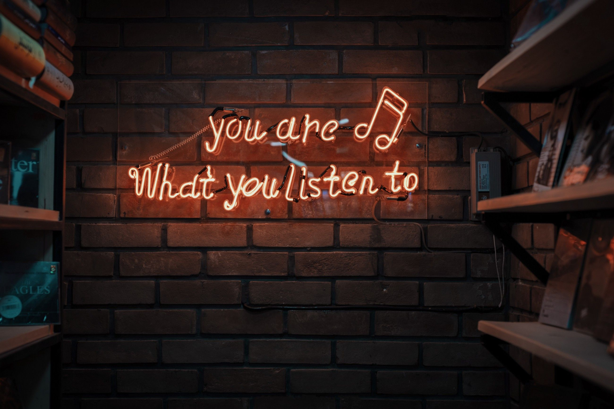
[Pinterest.com](https://in.pinterest.com/pin/684758318330686093/)


## Background & Motivation

We all have heard of companies like Spotify, Apple Music, Amazon Music, Pandora, and others. They all have their own ways to recommend music to their users. Usually they are based on...

- User Ratings
- Similar Artists
- Similar Styles
- Similar Genres
- etc….

But what if we want more control over our recommenders?

I have been in the music world for over 17 years as a songwriter, multi-instrumentalist, composer and producer, and I am always dissapointed with the tools available to help creators in their process.

I aim to create a new song recommender that incorporates song topics, based on their lyrics, into it, as well as acoustic features, all inputed by the user.

This recommender will user NLP and Clustering models to find similarities between user input and item features to generate recommendations

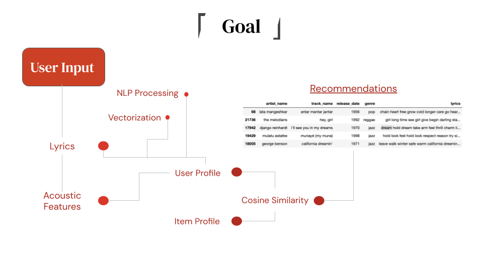

## Data

The main dataset used for this project is titled "Music Dataset: Lyrics and Metadata from 1950 to 2019" made available by [Mendeley Data](https://data.mendeley.com/datasets/3t9vbwxgr5/2). This lengthy dataset includes artist names, songs, lyrics, acoustic metadata and genres for tracks dating back to 1950. It has 28371 rows of data, with each giving information on an individual song. For the purpose of this project, this dataset was condensed into only artist name, track name, genre and lyrics.

| artist_name     | track_name | genre   |   release_date | lyrics |
|----------:|------:|------:|----:|-----:|
|backstreet boys | as long as you love me | pop     |           1996 | long loneliness friend leave life hand people crazy blind risk glance blind mystery head care write history long care long care long...|

## Workflow

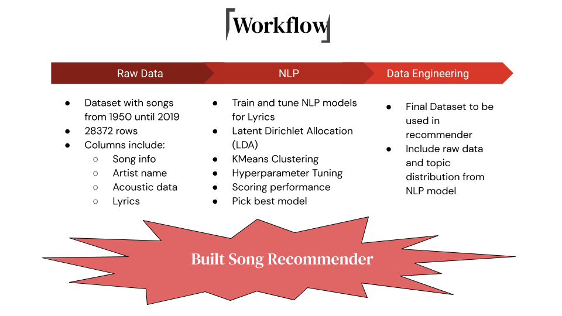

## Explaining Acoustic Features

Take a look at the follow images. How would you describe the music based only on the pictures?

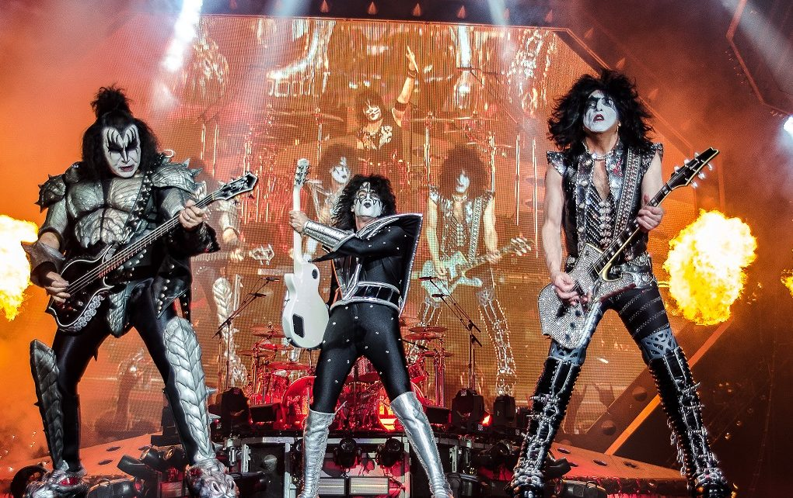

Impressions...

- Loud
- Energetic
- Heavy
- Party every day

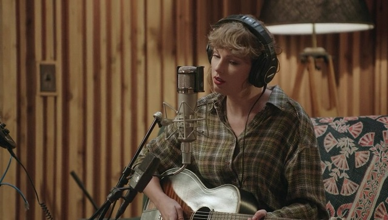

- Mellow
- Sad
- Slow
- Breakups

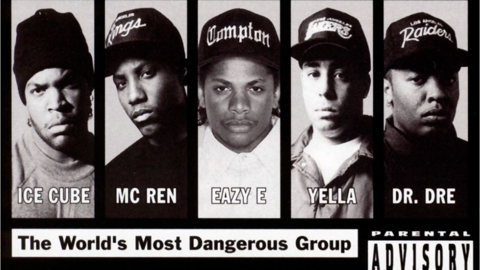
- Angry
- Social Critic
- “Wordy”
- *&#^*$(

These descriptions can all be summarized and calculated. These calculations are now widely based on Spotify's API. These are the _Acoustic Features_ of a song.

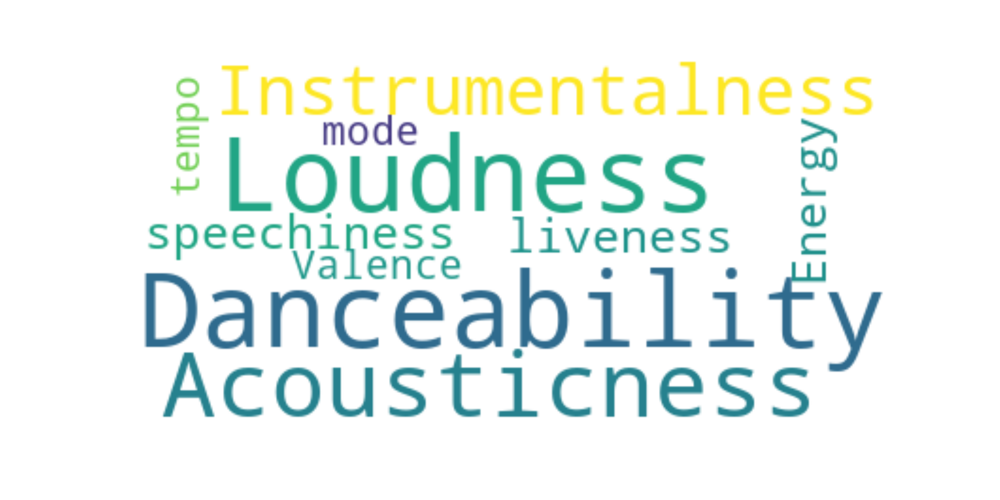

The Spotify API allows us to look into those features for all songs on their library. Lukily, our dataframe already contains that information.

## Calculating Topics

In this part of the process, two Natural Language Processing models were created. The Latent Dirichlet Allocation (LDA) was the best performing one in opposition to a KMeans clustering model. LDA models are soft models, which allows words to be part of more than one cluster/topic.

Two main components are tuned in order to get the best predictions. K value or ```n_clusters``` value, and the ```learning_decay``` value. The _perplexity_ score was used to evaluate performance.

> Perplexity captures how surprised a model is of new data it has not seen before, and is measured as the normalized log-likelihood of a held-out test set.


Even though ```k = 4``` gave the best score, unsupervised learning models are not as black and white. Because they don't have a target based on other features, it is hard to have a precise accuracy measure. Therefore, I ended up using ```k = 5``` as it had the best balance between the perplexity score and the visual coherence of the topics, which will be shown later on.

Assuming ```k = 5```, different values of the ```learning_decay``` were tested:


Thus, our final model was tuned to ```n_clusters = 5``` and ``` learning_decay = 0.7```

## Analizing the Clustering Results

The LDA model clusters words together based on their similatities. As a songwriter who is interested in the words, it was helpful to pull up as many words as possible and look at the the most discriptive words one by one. Here are the top 50 words per topic according to our model:


> Topic 1: \
long night **home** blue tonight play **music** hear comin bring radio dance **sing** **roll** ring **swing** woah lookin band song guitar songs morning doin **christmas** tryin little walkin young **lord** listen train tire tell school waitin wine **country** thinkin **movin** lovin runnin days gyal bass record alright **rhythm** good **dancin**

>Topic 2: \
away **life heart** feel **live** leave want **world break** think mind need tell look good change **dream** eye lose **believe** walk fall stay things tear inside turn love place long stand hand remember **face** true night better wanna little start wait **girl** lonely days wish **forget wrong** hard today hurt

>Topic 3: \
f@@k **money** s@@t b@@@h wanna want tell gotta better good bout real **party** think need ready **play** talk look stop **girl smoke** game people **damn** everybody check roll drop **kick head drink beat** little goin start watch **high** work feel mouth **sick** talkin stick hard nothin ball straight **shoot** hand

>Topic 4: \
**sing hear song sweet fall kiss** word **cold** night **sleep miss dream** arm summer touch **devil sound write voice dear** bring light speak lips warm little power lover river **human burn read moon** babylon music build desire strong snow winter land thrill begin whisper hand spring near **ring promise freedom**

>Topic 5: \
**black kill dead fight** head **blood lyric hell death** commercial hand **shoot** stand **grind soul** white **burn save lord live die bleed** follow scream hole **rise** water skin **fear** breathe earth face **ghost blind** bear land lie body shame wind **grave cross truth raise children bury**

## Putting It All Together

### User example.

Let's say our user's name is John Mayer and he has the following song:

**USER**


**SONG**
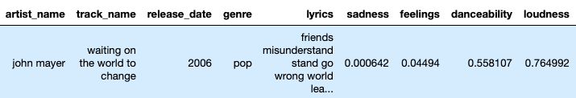
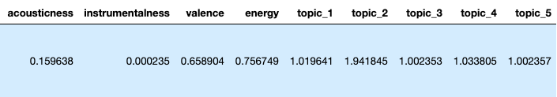

<br>

He wants to get recommendations based on his song. For that, he will be able to input his lyrics and acoustic features into the recommender:

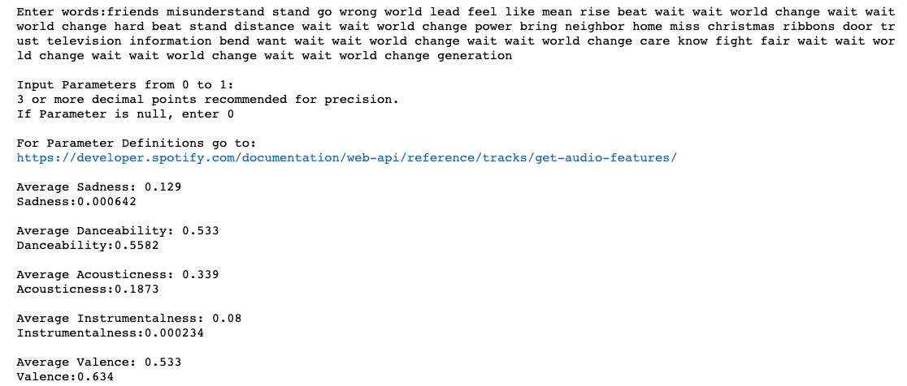

<br>

With that input, these are the recommended songs:

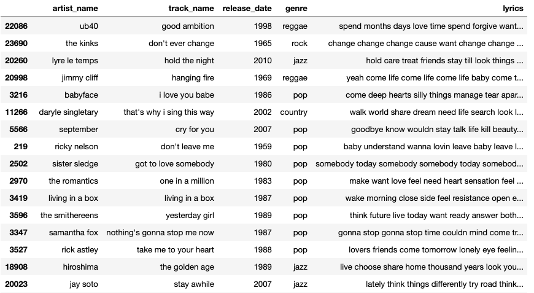


