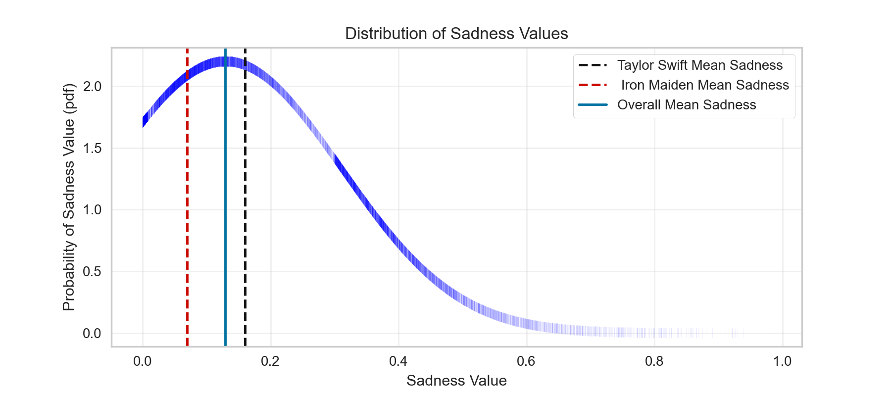

# Music for Creators - Take Control of Your Music Recommenders
_by Pedro Meyer_

[Pinterest.com](https://in.pinterest.com/pin/684758318330686093/)

## Background & Motivation

We all have heard of companies like Spotify, Apple Music, Amazon Music, Pandora... They all have their own ways to recommend music to their users. Usually, they are based on:

- User Ratings
- Similar Artists
- Similar Styles
- Similar Genres

But what if we want more control over our recommenders?

I have been in the music world for over 17 years as a songwriter, multi-instrumentalist, composer and producer, and I am always dissapointed with the tools available to help creators in their process.

The goal is to create a recommender where the user can input lyrics and acoustic data from their own songs to get more customized song recommendations.

Users will get value in form of:
- Inspiration
- Insight on their creative process
- Comparison with other artists

This recommender will use Natural Language Processing models to find similarities between user input and item features to generate recommendations

## Workflow

## Data

The main dataset used for this project is titled "Music Dataset: Lyrics and Metadata from 1950 to 2019" made available by [Mendeley Data](https://data.mendeley.com/datasets/3t9vbwxgr5/2). This lengthy dataset includes artist names, songs, lyrics, acoustic metadata and genres for tracks dating back to 1950. It has 28371 rows of data, with each giving information on an individual song. For the purpose of this project, this dataset was condensed into only artist name, track name, genre and lyrics.

| artist_name     | track_name | genre   |   release_date | lyrics |
|----------:|------:|------:|----:|-----:|
|backstreet boys | as long as you love me | pop     |           1996 | long loneliness friend leave life hand people crazy blind risk glance blind mystery head care write history long care long care long...|

## Acoustic Features

The _Acoustic Features_ are the acoustic qualities of a song. These calculations are now widely based on Spotify's API. They quantify how a track sounds like.

There are many acoustic features, also called acoustic metadata. This recommender will use the following features:

- Sadness
- Acousticness
- Valence
- Energy
- Danceability

The Spotify API allows us to look into those features for all songs on their library.

## Acoustic Features - Sadness

Let's take 'Sadness' for example. 'Sadness' is a combination of a low 'Valence' and 'Energy' scores:

> Valence:
*Describes the musical positiveness conveyed by a track.*

> Energy:
*Represents a perceptual measure of intensity and activity. Typically, energetic tracks feel fast, loud, and noisy.*

 

This is the distribution of 'Sadness' in the recommender's database:

## Making it Concrete

As ilustration, here is how these two artists compare in terms of 'Sadness' and how they place in the scale:

 
 

 

As expected, Iron Maiden has a lower average 'Sadness' score than Taylor Swift

## Topics Features - Natural Language Processing

In this part of the process, two Natural Language Processing models were created. The Latent Dirichlet Allocation (LDA) was the best performing one in opposition to a KMeans clustering model. LDA models are soft-clustering models, which allows words to be part of more than one cluster/topic.

The LDA model will take the raw lyrics from the database and cluster them into topics that will then be used as a comparison feature to the user input.

 

## Analizing the Clustering Results

The LDA model clusters words together based on their similatities. As a songwriter who is interested in the words, it was helpful to pull up as many words as possible and look at the the most discriptive words one by one. Here are the top 50 words per topic according to this model:

| Topic | Most Common Words |
|-|-|
| Religious | long night **home** blue tonight play **music** hear comin bring radio dance **sing** **roll** ring **swing** woah lookin band song guitar songs morning doin **christmas** tryin little walkin young **lord** listen train tire tell school waitin wine **country** thinkin **movin** lovin runnin days gyal bass record alright **rhythm** good **dancin** |
| Human Struggle | away **life heart** feel **live** leave want **world break** think mind need tell look good change **dream** eye lose **believe** walk fall stay things tear inside turn love place long stand hand remember **face** true night better wanna little start wait **girl** lonely days wish **forget wrong** hard today hurt |
| Party/Fun | f@@k **money** s@@t b@@@h wanna want tell gotta better good bout real **party** think need ready **play** talk look stop **girl smoke** game people **damn** everybody check roll drop **kick head drink beat** little goin start watch **high** work feel mouth **sick** talkin stick hard nothin ball straight **shoot** hand |
| Senses | **sing hear song sweet fall kiss** word **cold** night **sleep miss dream** arm summer touch **devil sound write voice dear** bring light speak lips warm little power lover river **human burn read moon** babylon music build desire strong snow winter land thrill begin whisper hand spring near **ring promise freedom** |
| Anger/Dissent | **black kill dead fight** head **blood lyric hell death** commercial hand **shoot** stand **grind soul** white **burn save lord live die bleed** follow scream hole **rise** water skin **fear** breathe earth face **ghost blind** bear land lie body shame wind **grave cross truth raise children bury** |

## Proof of Concept

Let's say our user is a guy named John Mayer and he has the following song:

[Waiting on the World to Change](https://www.youtube.com/watch?v=pquX7Ya4-wE)
    
 

He would input the features for his songs, including lyrics and acoustic features:

 
 
 

That input would give the following recommendations:

| Artist Name | Track Name | Release Year | Genre | Lyrics |
|-|-|-|-|-|
| Paul McCartney | Ram On | 1971 | Rock | Ram on, give your heart to somebody Soon, right away, right away Who's that coming now, they're coming Who's that coming now, now, baby? |
| The Black Keys | Thickfreakness | 2003 | Blues | Here I am darling And I'll care for you, hey that's all I want to do Hold me, love me, in your heart And I'll hold you near and I'll whisper in your ear I'll take your hand and I'll make you understand Hold me, love me in your heart |
| George Benson | When Love Has Grown | 1973 | Jazz | When love has grown Up to the point of love When the tears that are cried Are not the sweet tears of joy You know the sun has surely made its final dawning When love has died Instead of growing on When love can grow Up to the point of love When the tears that are cried Can be the sweet tears of joy Then we'll have days that are filled with days and nights Of loving, you & me Then love will ever be growing on When love can grow Up to the point of love Mmmm, when the tears that are cried Can be the sweet tears of joy Then we'll have days that are filled with days and nights Of loving, you & me Then love will ever be growing on |

## And Just for Reference...

This is how the average John Mayer song, and the 'Waiting on the World to Change" song stack up on the 'Sadness' distribution:

## Future Work

Now that the recommender is live, a few steps can be made in the future to optimize it:

- Add more feature
- Make results more customizable, sort the results by year and genre for example
- Add "Explicit" filter
- Create a user interface

## Conclusion
With this new recommender, musicians can input detailed information in order to get more tailored song recommendations. These songs can be used in a number of ways to help musicians in their creative process.

# References

Data:
[Mendeley Data](https://data.mendeley.com/datasets/3t9vbwxgr5/2)

Acoustic Features: \
[Get Audio Features for a Track](https://developer.spotify.com/documentation/web-api/reference/tracks/get-audio-features/) \
[Can data reveal the saddest number one song ever?](https://www.bbc.com/culture/article/20180821-can-data-reveal-the-saddest-song-ever)

Images: \
[Sadness Spectrum Graph](https://www.bbc.com/culture/article/20180821-can-data-reveal-the-saddest-song-ever) \
[Iron Maiden Album Cover](https://www.target.com/p/iron-maiden-life-after-death-cd/-/A-80178481) \
[Taylor Swift Album Cover](https://people.com/music/taylor-swift-album-covers-roundup/) \
[John Mayer User Profile Picture](https://imgur.com/gallery/LZt3K) \
[Continuum Album Cover](https://en.wikipedia.org/wiki/Continuum_(John_Mayer_album))

# Appendix

## Remaining Acoustic Feature Distributions

 

## LDA Model Tuning

 

## KMeans Model Tuning

